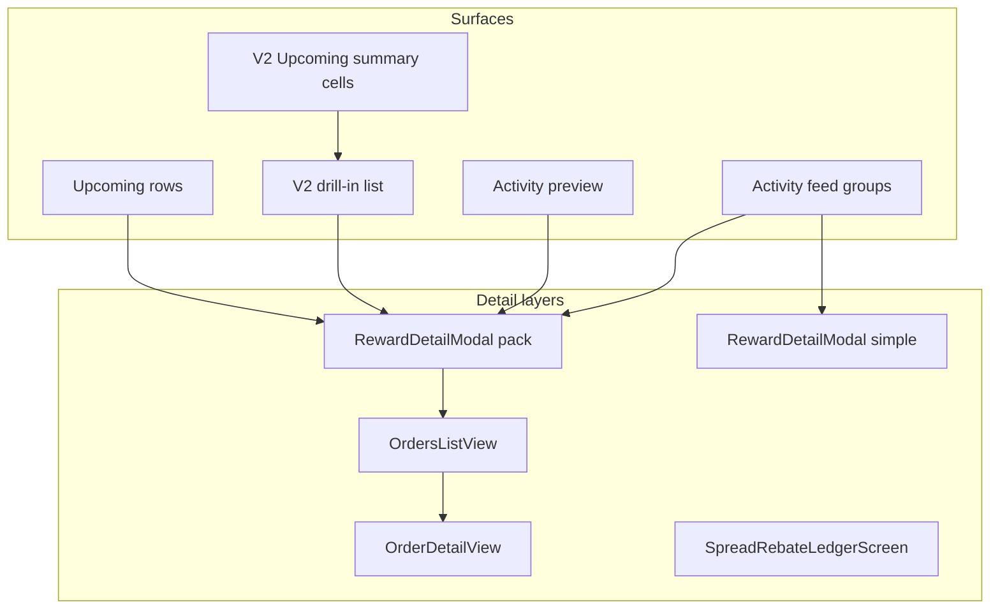

# Каталог транзакций и детализаций

Единый ревью-документ прототипа **Exness Rewards**: какие виды транзакций и агрегаций есть, где они показываются, какие поля на каждом уровне (list → modal → order), откуда данные в коде.

**Связанные документы (не дублируем здесь целиком):**

| Документ | Роль |
|----------|------|
| [`TRANSACTION_SUMMARY_DISPLAY_RULES.md`](TRANSACTION_SUMMARY_DISPLAY_RULES.md) | Копирайт и правила **Upcoming drill-in** (USD / EXD) |
| [`FINTECH_TRANSACTION_DETAIL_UX.md`](../research/FINTECH_TRANSACTION_DETAIL_UX.md) | Mobbin-benchmark: transaction/reward **detail** в fintech (Revolut, Wise, Coinbase, …) |
| [`TRANSACTION_DETAIL_FINTECH_GAP_ANALYSIS.md`](../research/TRANSACTION_DETAIL_FINTECH_GAP_ANALYSIS.md) | Сверка Kind ID Exness × fintech patterns, P0/P1 рекомендации |
| [`REWARD_LIFECYCLE.md`](REWARD_LIFECYCLE.md) | Бизнес-сценарий, цифры моков, 9 шагов симулятора |
| [`EXD_EARNING_MATH.md`](EXD_EARNING_MATH.md) | Формула EXD за сделку, EXD spent, rate, booster, агрегация |
| [`UX_MAP.md`](../architecture/UX_MAP.md) | Назначение блоков UI и сквозные UX-правила |
| [`ARCHITECTURE.md`](../architecture/ARCHITECTURE.md) | Поток данных и модули |

---

## 0. Как пользоваться

### Порядок ревью

1. **§2 Master-таблица** — сверить канонические типы, gaps и `rewardModal`.
2. **§3 Агрегации** — сводки и drill-in (не путать с одиночной строкой).
3. **§4 Матрицы полей** — по каждому Kind ID: list / modal / order.
4. **§5 Variants** — привязка к конфигу и `packOverride`.
5. **§6 Planned** — будущие типы (Spread rebate и др.).
6. **§7–§8** — масштабируемость, API, regression.

### Легенда колонок ревью

В таблицах ниже колонки для заполнения при ревью:

| Колонка | Значения |
|---------|----------|
| **Review: copy** | `OK` / `TBD` / комментарий |
| **Review: UX** | `OK` / `TBD` / комментарий |
| **Review: API** | имя поля API или `TBD` |
| **Data source** | `static` — только `PACK_CONFIG` / `SIMPLE_CONFIG`; `simulator-dynamic` — `buildRewardModalPackOverride`; `mock-only` — строка из мока, модалка не синхронизирована; `not-wired` — variant есть, в моках не используется |
| **Scalability note** | риски (дубли title, хардкод label, и т.д.) |

### Copy dictionary (EN, прототип)

Два слоя: **list `lines[]`** (разговорные фразы) vs **modal `details[].label`** (имена полей). Дата в label без *-ed* для future; chip задаёт время.

| Kind | List subtitle | Modal: When | Modal: From | Modal: To | Modal: Why / period |
|------|---------------|-------------|-------------|-----------|---------------------|
| `loyalty_upcoming` | `For trading on {пн–вс}` | **Available on** | — | **To wallet** → Available rewards | **For trading on** → `{пн–вс}` |
| `loyalty_activated` | `To wallet` + `For trading on {пн–вс}` | **Activated on** | — | **To wallet** → Available rewards | **For trading on** → `{пн–вс}` |
| `cashback_upcoming` | **For trading with EXD** | **Credits on** | — | — | **For trading on** → `{day}` |
| `cashback_credited` | **For trading with EXD** + `Account: #…` в list | **Credited on** | — | **To account** | **For trading on** → `{day}` |
| `transfer_exd` | `To account: #…` | **Completed on** | **From** → Available rewards | **To account** | — |
| `promo_gift` | промо-текст | **Credited on** | — | **To wallet** → Available rewards | — (поздравление + steel banner в modal) |
| `exd_adjustment` | Reason + Account | **Processed on** | **From** → Available rewards | **To account** | **Reason** |

Константа list cashback: `CB_LIST_SUBTITLE` в [`demoTimeline.ts`](../../src/rewardLifecycle/demoTimeline.ts). День для модалки при subtitle без даты — `CB_PENDING_TRADE_DAY_SHORT`.

**Status chip (modal hero):** `warning` → **Upcoming**; `success` → **Activated**, **Credited**, **Completed** (transfer); `negative` → **Adjusted**. Promo gift: chip **Credited** (не «Promo»). Adjustment: только chip красный; сумма в hero — обычный цвет (без `amountTone: negative`).

**Порядок полей в modal:** **When → From → To → Why → Other** (пропускайте слот, если поля нет). Для pack после summary — блок **Orders**. Simple transfer: Completed on, From, To account.

**Datetime в modal `details[]` и order detail** (поля с временем): `{Mon} {d}, {yyyy}, {HH}:{mm} UTC` — [`formatModalDateTimeUtc.ts`](../../src/domain/reward/formatModalDateTimeUtc.ts). **For trading on** — только дата/период, без UTC.

**Datetime в list** (`TransactionRow.trailing`, `OrderInPack.date`, Last orders): `{Mon} {d}, {HH}:{mm}` или `on Mar 25` / `23:58` — **без года и без UTC** — [`formatListDateTime.ts`](../../src/domain/reward/formatListDateTime.ts).

---

## 1. Контракт строки списка

Общая модель [`TransactionRowModel`](../../src/domain/reward/transactionTypes.ts). Адаптеры: [`transactionAdapters.ts`](../../src/domain/reward/transactionAdapters.ts).

| Поле | Источник | Описание |
|------|----------|----------|
| `icon` | `RewardEventIcon` | `dollar` \| `crown` \| `gift` \| `transfer` \| `crownOff` |
| `title` | item | Заголовок строки |
| `amount` | item | Строка суммы, напр. `+3.20 EXD`, `+5.00 USD` |
| `amountTone` | feed / preview | `positive` \| `neutral` \| `negative` (Upcoming — без tone в типе, UI нейтральный) |
| `lines[]` | item | 1–2 подписи под заголовком |
| `trailing` | `date` (Upcoming) или `time` (feed) | Правая колонка |
| `badge` | только `LifecycleUpcomingItem` | Число сделок в пачке (напр. `4`) |
| `rewardModal` | item | Ключ [`RewardModalVariant`](../../src/components/reward/rewardModalTypes.ts) |
| `category` | только `ActivityFeedItem` | Фильтр ленты: `rewards` \| `cashback` \| `transfers` \| `others` |

**Где строка появляется:**

| Surface | Тип данных | Клик → modal |
|---------|------------|--------------|
| Upcoming (Rewards) | `lifecycle.upcoming[]` | да, `itemId` = `upcoming.id` |
| Upcoming drill-in | те же строки, отфильтрованные по USD/EXD | да, `upcomingId` |
| Activity preview (Rewards) | `activityPreview[]` | да, без `itemId` (кроме loyalty — см. §5) |
| Activity feed | `feedGroups[].items[]` | да, `itemId` = `feed item.id` |

---

## 2. Master-таблица: канонические типы (реализовано)

Одна строка = **бизнес-тип + состояние**, не каждый mock `id`.

| Kind ID | List title | State | Currency | Icon | `rewardModal` | Pack? | Surfaces | Feed filter | List copy rules | Modal override | Data source (modal) | Known inconsistency | Review: copy | Review: UX | Review: API |
|---------|------------|-------|----------|------|---------------|-------|----------|-------------|-----------------|----------------|---------------------|---------------------|--------------|------------|-------------|
| `loyalty_upcoming` | Loyalty rewards | Upcoming | EXD | crown | `loyalty-upcoming` | yes | Upcoming, drill EXD | — | агрегат **пн–вс**; TRANSACTION_SUMMARY §2; `lines[0]`: `For trading on {пн–вс}`; `date`: `on {среда зачисления}` | `buildRewardModalPackOverride` + `upcoming.id` | `simulator-dynamic` | — | | | |
| `loyalty_activated` | Loyalty rewards | Activated | EXD | crown | `loyalty-activated` | yes | Feed, activity preview | rewards | `lines[0]`: `To wallet`; `lines[1]`: `For trading on {period}`; `trailing`: время | override если `feedItemId`; иначе preview → dynamic; иначе static | `simulator-dynamic` или `static` | — | | | |
| `cashback_upcoming` | EXD cashback | Upcoming | USD | dollar | `cashback-upcoming` | yes | Upcoming, drill USD | — | list: **For trading with EXD**; modal: Credits on + For trading on | `buildRewardModalPackOverride` + `upcoming.id` | `simulator-dynamic` | — | | | |
| `cashback_credited` | EXD cashback | Credited | USD | dollar | `cashback-activated` | yes | Feed, preview | cashback | list: **For trading with EXD**; `lines[1]`: Account | override если `feedItemId`; иначе preview → dynamic | `simulator-dynamic` / static fallback | — | | | |
| `transfer_exd` | Transfer | Completed | EXD | transfer | `transfer-exd` | no | Feed, preview | transfers | `lines[0]`: `To account: #…` | — | `static` | amount на list может быть без знака `+` | | | |
| `promo_gift` | Birthday gift | Credited | EXD | gift | `promo-gift` | no | Feed, preview | rewards | `lines[0]`: промо-текст | — | `static` | chip **Credited**; modal To + Credited on | | | |
| `exd_adjustment` | EXD adjustment | Adjusted | EXD | crownOff | `exd-adjustment` | no | Feed, preview | others | `lines[0]`: `Balance correction`; `lines[1]`: `Account: #…` | — | `static` | chip **Adjusted**; hero amount не красный | | | |

\* Pack для credited cashback: только [`PACK_CONFIG['cashback-activated']`](../../src/components/reward/RewardDetailModal/configs/packConfigs.ts). Строка ленты **не** подтягивает сумму/период в модалку.

**Legacy variant (не в моках):** `cashback-activated-jan12` — отдельный static pack с датой 12 Jan; **ни один** item в `feedGroupsData` / `lifecycleSteps` его не использует (`not-wired`).

---

## 3. Агрегации и кликабельные сводки

Не одиночная транзакция, а контейнер или второй уровень навигации.

| Aggregation | Где | Клик | Что открывает | Параметры сводки | Data source | Review: copy | Review: UX |
|-------------|-----|------|---------------|------------------|-------------|--------------|------------|
| Upcoming — cell **USD** | Rewards, блок Upcoming | да | `V2SummaryCurrencyDetailPage` (`currency: usd`) | Сумма всех `upcoming[]` с `icon: 'dollar'`; заголовок ячейки «EXD cashback» | агрегат из `lifecycle.upcoming` | | |
| Upcoming — cell **EXD** | Rewards, блок Upcoming | да | drill (`currency: exd`) | Сумма всех `icon: 'crown'`; заголовок ячейки «Rewards» | то же | | |
| Drill-in **hero** | Внутри drill page | нет | — | Сумма отфильтрованных строк; группы **Tomorrow** / `Mar 25` от `demoTodayIso` | [`buildDrillEntriesFromUpcoming`](../../src/screens/ExnessRewardsScreen.tsx) | см. TRANSACTION_SUMMARY §4 | |
| Drill-in **row** | Список в drill | да | `RewardDetailModal` | те же поля, что Upcoming row + `upcomingId` | `lifecycle.upcoming[]` | TRANSACTION_SUMMARY §1–2 | |
| Activity feed **day group** | Activity feed | нет (только items) | — | `dateLabel`, `dateIso`, `summary` (сумма за день) | `ActivityFeedGroup` | | |
| **Lifetime cashback** | Rewards | заголовок секции → feed | Activity feed, preset `category: cashback` | `lifetimeCashbackUsd` | `LifecycleStep` | не modal | UX_MAP § Lifetime |
| Modal — **orders preview** | `RewardDetailModal` pack | «View all» / chevron | `OrdersListView` | Последние `ORDERS_PREVIEW_COUNT` (3); без override — expand до 200 demo | [`orderDemo.ts`](../../src/components/reward/RewardDetailModal/configs/orderDemo.ts) | | |
| Modal — **order row** | pack / orders list | да | `OrderDetailView` | `OrderInPack.detail` | pack config или dynamic builder | | |
| **Spread rebate** (прототип) | Upcoming rows (rebate demo) | `opensRebateLedger` | `SpreadRebateLedgerScreen` | см. §6 | `rebateSimulatorSteps` | planned | |

**Drill-in:** long-term rebates **не** показываются ([`TRANSACTION_SUMMARY_DISPLAY_RULES.md`](TRANSACTION_SUMMARY_DISPLAY_RULES.md) §5).

---

## 4. Матрицы полей по Kind ID

Навигация модалки (pack): `pack` → `orders` → `orderDetail` ([`RewardDetailModal.tsx`](../../src/components/reward/RewardDetailModal/RewardDetailModal.tsx)). Simple — только один экран.

### 4.1 `loyalty_upcoming`

#### Смысл (продукт)

**Агрегация (пачка)** pending EXD по loyalty — не одна сделка:

| Аспект | Правило |
|--------|---------|
| Что в сумме | Все начисления loyalty за сделки в **календарной неделе пн–вс** |
| Статус | Upcoming — ещё не в **Available rewards** |
| Зачисление | **Среда после** недели заработка (`on Mar 25` для пачки Mar 16–22) |
| UI | Одна строка Upcoming = одна неделя; модалка = сумма пачки + ордера по сделкам |

См. [`REWARD_LIFECYCLE.md`](REWARD_LIFECYCLE.md) §2, [`demoTimeline.ts`](../../src/rewardLifecycle/demoTimeline.ts). Накладка двух пачек — TRANSACTION_SUMMARY §3.

#### List row

| Поле | Правило / пример | Review: copy | API |
|------|------------------|--------------|-----|
| `title` | `Loyalty rewards` (пачка) | OK | |
| `amount` | `+N.NN EXD` — сумма пачки | | `pack_total_exd` |
| `lines[0]` | `For trading on Mar 16–22` — неделя **пн–вс** | OK | `earning_week` |
| `date` / trailing | `on Mar 25` — дата зачисления в Available | TRANSACTION_SUMMARY §2 | `activation_date` |
| `badge` | опционально: число сделок в пачке | | `trade_count` |
| `icon` | `crown` | | |

#### Modal (pack, dynamic)

| Поле | Static fallback | Dynamic (`buildLoyaltyPackFromUpcomingRow`) | Review: API |
|------|-----------------|---------------------------------------------|-------------|
| `navTitle` | Loyalty rewards | Loyalty rewards | |
| `chip` | Upcoming / warning | Upcoming / warning | `status` |
| `heroIcon` | crown | crown | |
| `amount` | +45.78 EXD (demo) | из `row.amount` (= сумма пачки) | `pack_total_exd` |
| `details[0]` | **Available on** | из `row.date` → `becomeAvailableOn()` | `available_at` |
| `details[1]` | **To wallet** → Available rewards | **To wallet** → Available rewards | `destination_wallet` |
| `details[2]` | **For trading on** | value: неделя пн–вс (из `lines[0]`) | `earning_week` |
| `orders[]` | 3 demo orders | split по `badge` / сумме | `orders[]` |

#### Order (внутри pack)

| Уровень | Поля |
|---------|------|
| List row | `title`: **Loyalty reward** (одна сделка); `amount`: доля EXD; `meta`: Account, Order |
| Order detail | **When** → **Account** → Order › → **Earning rate** `5.34%` + info icon → **Booster** tier chip → **Calculation** `Details` › — sheets: [`REWARD_CALCULATION_UX.md`](../research/REWARD_CALCULATION_UX.md) · earning rate [`EARNING_RATE_EXPLAINER_UX.md`](../research/EARNING_RATE_EXPLAINER_UX.md) (формула: [`EXD_EARNING_MATH.md`](EXD_EARNING_MATH.md)) |

---

### 4.2 `loyalty_activated`

#### List row

| Поле | Правило / пример | Review: copy | API |
|------|------------------|--------------|-----|
| `title` | `Loyalty rewards` | | |
| `amount` | `+N.NN EXD` | | |
| `lines[0]` | `To wallet` | | |
| `lines[1]` | `For trading on Mar 9–15` (неделя пн–вс) | | |
| `trailing` | `23:58` (feed) или `Mar 18, 23:58` (preview) | | |
| `icon` | `crown` | | |
| `category` | `rewards` | | |

#### Modal (pack)

| Поле | Static | Dynamic (`buildLoyaltyPackFromFeedItem` / preview) | Review: API |
|------|--------|-----------------------------------------------------|-------------|
| `navTitle` | Loyalty rewards | Loyalty rewards | |
| `chip` | Activated / success | Activated / success | |
| `details[0]` | **Activated on** | `{groupDateLabel}, {time}` или `row.date` (preview) | `activated_at` |
| `details[1]` | **To wallet** → Available rewards | **To wallet** → Available rewards | `destination_wallet` |
| `details[2]` | **For trading on** | value: неделя пн–вс (из `lines[1]`) | `earning_week` |
| `orders[]` | 2 demo | split из суммы item | |

#### Order detail (activated)

**When** Posted on → **To** To account → Order › → **Why** Booster → Earning rate › `5.34%` (Credited to только в pack hero **To**).

---

### 4.3 `cashback_upcoming`

#### List row

| Поле | Правило / пример | Review: copy | API |
|------|------------------|--------------|-----|
| `title` | **EXD cashback** (не «Cashback») | TRANSACTION_SUMMARY §1 | |
| `amount` | `+N.NN USD` | | |
| `lines[0]` | **For trading with EXD** (без даты; день в modal **For trading on**) | OK | |
| `date` | `on Mar 23` | | `credit_date` |
| `icon` | `dollar` | | |

#### Modal (pack, dynamic)

| Поле | Static fallback | Dynamic (`buildCashbackPackFromUpcomingRow`) | Review: API |
|------|-----------------|----------------------------------------------|-------------|
| `navTitle` | EXD cashback | EXD cashback | |
| `chip` | Upcoming / warning | Upcoming / warning | |
| `heroIcon` | dollar | dollar | |
| `amount` | +3.70 USD | из `row.amount` | `total_usd` |
| `details[0]` | **Credits on** | `creditsOn(row.date)` | `credit_at` |
| `details[1]` | **For trading with EXD on** | value: `CB_PENDING_TRADE_DAY_SHORT` если list без даты | `trade_day` |
| `orders[]` | **+USD** per order; meta `For trading with EXD` + Order | split total USD; EXD debited in order detail | |

#### Order (cashback leg — upcoming or credited pack)

List: **EXD cashback**, amount **+USD**; meta **For trading with EXD** + **Order** (без Account). Detail hero: **+USD**; chip **Upcoming** или **Credited**. **Order (оба leg):** **Converted on** (info) → **Account** → **EXD debited** (info) → **For trading with EXD on** → **Order** › → **Cashback rate** (info). Pack hero credited по-прежнему **To account**.

---

### 4.4 `cashback_credited`

#### List row

| Поле | Пример (мок) | Review: copy | API |
|------|--------------|--------------|-----|
| `title` | EXD cashback | | |
| `amount` | +5.00 USD | | |
| `lines[0]` | For trading with EXD | | |
| `lines[1]` | Account: #12345678 | | |
| `trailing` | 08:00 | | |
| `category` | cashback | | |

#### Modal (pack)

| Поле | Static fallback | Dynamic (`buildCashbackPackFromFeedItem` / preview) | Review: API |
|------|-----------------|-----------------------------------------------------|-------------|
| `navTitle` | EXD cashback | EXD cashback | |
| `chip` | Credited / success | Credited / success | |
| `amount` | demo USD | из `item.amount` | `total_usd` |
| `details[0]` | **Credited on** (UTC) | `groupDateLabel` + `time` или `row.date` | `credited_at` |
| `details[1]` | **For trading with EXD on** | `{day}` без года/UTC (T−1 от credit или из lines) | `trade_day` |
| `details[2]` | **To account** (credited only) | из lines | `account_id` |
| `orders[]` | **+USD** per order (как upcoming) | split USD; EXD в order detail | |

Порядок hero credited: **When → To account → Why**.

#### Order detail (cashback leg)

См. §4.3 — те же поля и chip **Debited** для credited pack.

---

### 4.5 `transfer_exd`

#### List row

| Поле | Пример |
|------|--------|
| `title` | Transfer |
| `amount` | `52.80 EXD` (neutral) |
| `lines[0]` | To account: #12345678 |
| `category` | transfers |

#### Modal (simple — [`SIMPLE_CONFIG`](../../src/components/reward/RewardDetailModal/configs/simpleConfigs.ts))

| Поле | Значение (demo) | Review: API |
|------|-----------------|-------------|
| `navTitle` | Transfer | |
| `chip` | **Completed** / success | OK |
| `heroIcon` | transfer | |
| `amount` | 30.00 EXD (static demo ≠ list mock) | **gap** |
| `details` | **Completed on** (UTC); From → Available rewards; To account | |

Нет уровня order.

---

### 4.6 `promo_gift`

#### List row

| Поле | Пример |
|------|--------|
| `title` | Birthday gift |
| `amount` | +50.00 EXD |
| `lines[0]` | Best wishes! ✨ |
| `category` | rewards |

#### Modal (simple)

| Slot | Label | Value (demo) | Review: API |
|------|-------|--------------|-------------|
| When | **Credited on** | Mar 19, 2026, 16:15 UTC | `credited_at` |
| To | **To wallet** | Available rewards | `destination_wallet` |
| Celebration | **Best wishes! ✨** + gift image (180px steel banner) | [`PromoGiftCelebration.tsx`](../../src/components/reward/RewardDetailModal/parts/PromoGiftCelebration.tsx) | `message`, `hero_asset` |

`chip`: **Credited** / success (не «Promo»). Без Campaign / Promo code / Reference. Строки **Comment** в `details[]` нет — поздравление отдельным блоком под полями.

---

### 4.7 `exd_adjustment`

#### List row

| Поле | Пример |
|------|--------|
| `title` | EXD adjustment |
| `amount` | -0.40 EXD (negative tone в **list**; в modal hero — нейтральный) |
| `lines[0]` | Balance correction |
| `lines[1]` | Account: #12345678 |
| `category` | others |

#### Modal (simple)

| Slot | Label | Value (demo) | Review: API |
|------|-------|--------------|-------------|
| From | **From** | Available rewards | |
| When | **Processed on** | Mar 18, 2026, 23:59 UTC | |
| To | **To account** | #12345678 | |
| Why | **Reason** | Balance correction | |

`chip`: **Adjusted** / negative. Hero amount без красного tone (только chip). Без Case reference.

---

### 4.8 Сводка: order-level labels по типу пачки

| Pack kind | Order list `title` | Order detail labels |
|-----------|-------------------|---------------------|
| loyalty (upcoming/activated) | Loyalty reward | List: title + **x2** booster chip (Figma 41788:19744); detail: Account, Booster tier chip (39942:36880) |
| cashback (any pack chip) | EXD → Cashback | `chip` **Debited** / neutral |
| cashback (leg detail) | EXD → Cashback | **Converted on** (info) → **Account** → EXD debited → Why → Order › → Cashback rate |

**Helpers:** [`packDetailRows.ts`](../../src/components/reward/RewardDetailModal/configs/packDetailRows.ts) (pack hero), [`loyaltyOrderDetailRows.ts`](../../src/components/reward/RewardDetailModal/configs/loyaltyOrderDetailRows.ts), [`cashbackOrderDetailRows.ts`](../../src/components/reward/RewardDetailModal/configs/cashbackOrderDetailRows.ts).

### 4.9 Closed order sheet (Figma 42413:31780)

**Триггер:** Order › в order detail (loyalty или EXD → Cashback). Второй `ModalSheet` (`stacked`); **X** и chevron у **Rewards** → назад к order detail.

| Блок | Источник данных |
|------|-----------------|
| Торговые поля (symbol, prices, swap…) | Статичный демо [`closedOrderDemo.ts`](../../src/components/reward/RewardDetailModal/configs/closedOrderDemo.ts) |
| **Rewards → EXD earned** | Сумма loyalty legs с тем же Order ID; часы если chip leg **Upcoming** |
| **Rewards → Cashback from EXD** | Сумма `cashbackUsdLeg` / USD split по legs с тем же Order ID; часы если pack **не Credited** |

**Registry:** [`buildTradingOrderRegistryForStep`](../../src/rewardLifecycle/buildTradingOrderRegistry.ts) — только `step.upcoming` (не feed/preview: иначе суммирование чужих пачек на тот же Order ID). В модалке: `loyalty-upcoming` / `cashback-upcoming` → registry шага; activated/credited → только открытая `packOverride`. Static `PACK_CONFIG` — ingest пачки один раз. Order base: Mar 9–15 → `9088801+`, Mar 16–22 / linked cashback → `9100821+`.

**Связка order ID:** dynamic шаг `trade_exd_rebate` — loyalty и cashback upcoming на base `9100820` → order **9100821** (демо: +1.00 EXD и **−5.00 EXD** → 5.00 USD, 1:1). Шаг 8: credited `prev-cb` в registry для closed order.

---

## 5. `RewardModalVariant` ↔ конфиг ↔ override

| Variant | Config type | `PACK_CONFIG` / `SIMPLE_CONFIG` | `packOverride` (`App.tsx`) | `itemId` | Data source |
|---------|-------------|--------------------------------|-----------------------------|----------|-------------|
| `loyalty-upcoming` | pack | fallback static | yes — upcoming row | `upcoming.id` | simulator-dynamic |
| `cashback-upcoming` | pack | fallback static | yes — upcoming row | `upcoming.id` | simulator-dynamic |
| `loyalty-activated` | pack | fallback static | yes — feed item or preview | `feed item.id` (feed); preview без id | simulator-dynamic / static |
| `cashback-activated` | pack | fallback static | yes — feed item or preview | `feed item.id` (feed); preview без id | simulator-dynamic / static |
| `cashback-activated-jan12` | pack | static only | no | — | not-wired |
| `transfer-exd` | simple | static | — | — | static |
| `promo-gift` | simple | static | — | — | static |
| `exd-adjustment` | simple | static | — | — | static |

**Логика override:** [`buildRewardModalPackOverride`](../../src/rewardLifecycle/buildLoyaltyModalPack.ts) — `loyalty-upcoming`, `cashback-upcoming`, `loyalty-activated`, `cashback-activated`. Иначе для pack-variants используется `PACK_CONFIG[variant]`; для simple — `SIMPLE_CONFIG`.

**Demo expand orders:** если `packOverride == null`, список ордеров раздувается до `ORDERS_DEMO_TOTAL` (200) через `expandOrdersForDemo`.

---

## 6. Planned / TBD

Типы из продуктовых спек, **не** смешивать с §2 как «уже в UI».

### 6.1 Spread rebate (Daily spread rebate / T+60)

Источники: [`TASK_SPREAD_REBATE.md`](../specs/TASK_SPREAD_REBATE.md), [`DESIGN_SPREAD_REBATE.md`](../design/DESIGN_SPREAD_REBATE.md), [`PROTOTYPE_SPREAD_REBATE_SWITCHER_SPEC.md`](../specs/PROTOTYPE_SPREAD_REBATE_SWITCHER_SPEC.md).

| Planned kind | Surface (target) | Detail UI | Key params (draft) | Review: copy | Review: UX | Review: API |
|--------------|------------------|-----------|-------------------|--------------|------------|-------------|
| Spread rebate · EXD upcoming | Upcoming aggregate row | Ledger / program screen | `pendingExd`, `pendingCount`, `nextPayoutDate` | | | TBD |
| Spread rebate · USD upcoming | Upcoming aggregate row | Ledger | `pendingUsd`, `onHoldUsdCount`, `showAccountAlert` | | | TBD |
| Spread rebate payout (mature EXD) | Activity feed (future) | TBD modal vs ledger | `paidExdCount`, `paidExdAmount` | | | TBD |
| Rebate ledger line | [`SpreadRebateLedgerScreen`](../../src/screens/SpreadRebateLedgerScreen.tsx) | full screen | per-slot USD/EXD, hold state | | | TBD |

**Прототип сейчас:** [`RebateDemoState`](../../src/rewardLifecycle/rebateSimulatorSteps.ts) — `pendingCount`, `pendingExd`, `pendingUsd`, `nextPayoutDate`, `paidExdCount`, `paidExdAmount`, `onHoldUsdCount`, `showAccountAlert`, `usdAccountSelected`. Строки Upcoming с `opensRebateLedger` → **не** `RewardDetailModal`.

**Activity feed:** новый filter type **Spread rebate** — TBD ([`activityFeedTypes.ts`](../../src/screens/activityFeedTypes.ts) пока только all/rewards/cashback/transfers/others).

### 6.2 Long-term rebates

| Item | Surface | Click | Notes |
|------|---------|-------|-------|
| Long-term rebates banner | Rewards | нет modal | Инфо-баннер; **не** в Upcoming drill-in (TRANSACTION_SUMMARY §5) |

### 6.3 Failed / rejected (planned)

Типы с неуспешным исходом — **не в §2**, заложены для API и будущих моков.

| Planned state | Chip | Tone | Когда показывать | Modal (draft) |
|---------------|------|------|------------------|---------------|
| Transfer failed | **Failed** | `negative` | EXD не зачислен на счёт | **Failed on**, From, To account, Reason (код/текст) |
| Cashback / loyalty payout failed | **Failed** | `negative` | payout отклонён | When + Reason; без Orders или с failed legs |
| Adjustment reversed | TBD | TBD | отмена коррекции | отдельный kind или linked event |

**Правила (draft):** list row — `amountTone: negative` допустим; modal hero amount — нейтральный, как у adjustment; chip всегда **Failed** / negative. Поле When: `Failed on` с UTC.

### 6.4 Шаблон для новых типов

| Kind ID (draft) | List title | State | Currency | `rewardModal` (draft) | Pack? | Surfaces | Review: copy | Review: UX | Review: API |
|-----------------|------------|-------|----------|----------------------|-------|----------|--------------|------------|-------------|
| | | | | | | | | | |

---

## 7. Масштабируемость и UX (чеклист ревью)

Привязка к [`UX_MAP.md`](../architecture/UX_MAP.md) — модалка § и сквозные правила.

| # | Вопрос | Действие после ревью |
|---|--------|---------------------|
| 1 | Один `rewardModal` на **бизнес-тип + state**? | Удалить или привязать `cashback-activated-jan12` |
| 2 | List `title` = modal `navTitle`? | Выровнять EXD cashback / Cashback / Loyalty rewards |
| 3 | Словарь `details[].label` стабилен для API? | Заполнить колонку API в §4; вынести enum labels в domain при реализации |
| 4 | Когда нужен `packOverride` vs static? | Добавить `buildCashbackPackFromFeedItem` для `cashback-activated` |
| 5 | Orders: preview 3 vs full list vs API total | `ORDERS_PREVIEW_COUNT`, `ORDERS_DEMO_TOTAL` — только прототип |
| 6 | Один контракт строки: preview = feed = upcoming adapters | Не дублировать разметку вне `TransactionRow` |
| 7 | i18n | Все строки EN inline; колонка RU TBD в §4 |
| 8 | Tier progress vs cashback USD | EXD loyalty в Upcoming может влиять на hero; USD cashback — нет (UX_MAP) |
| 9 | Lifetime cashback → feed filter | Deep link `category: cashback` должен совпадать с `cashback_credited` rows |

---

## 8. Код и regression

### Ключевые файлы

| Файл | Роль |
|------|------|
| [`rewardModalTypes.ts`](../../src/components/reward/rewardModalTypes.ts) | Union variants |
| [`packConfigs.ts`](../../src/components/reward/RewardDetailModal/configs/packConfigs.ts) | Static pack content |
| [`simpleConfigs.ts`](../../src/components/reward/RewardDetailModal/configs/simpleConfigs.ts) | Simple modals |
| [`buildLoyaltyModalPack.ts`](../../src/rewardLifecycle/buildLoyaltyModalPack.ts) | Dynamic pack ↔ simulator |
| [`buildTradingOrderRegistry.ts`](../../src/rewardLifecycle/buildTradingOrderRegistry.ts) | Order ID → Rewards для closed order |
| [`feedGroupsData.ts`](../../src/rewardLifecycle/feedGroupsData.ts) | Feed item mocks |
| [`lifecycleSteps.ts`](../../src/rewardLifecycle/lifecycleSteps.ts) | Upcoming + preview per step |
| [`ExnessRewardsScreen.tsx`](../../src/screens/ExnessRewardsScreen.tsx) | Drill-in, summary cells |
| [`ActivityFeedScreen.tsx`](../../src/screens/ActivityFeedScreen.tsx) | Full feed + filters |

### Regression checklist (после правок по каталогу)

1. Симулятор: шаги 1→9, Назад/Далее.
2. Rewards: Upcoming rows + summary USD/EXD → drill → modal с корректными суммами для loyalty/cashback upcoming.
3. Activity preview и feed: те же `rewardModal`, что в §2.
4. Modals: все **wired** variants; навигация pack → orders → order detail.
5. `cashback-activated`: зафиксировать ожидание после sync (list date = modal date).
6. `npm run build` без ошибок.

### Открытые gaps (трекер)

| ID | Gap | Priority |
|----|-----|----------|
| G1 | ~~`cashback-activated` static Jan vs list~~ — `buildCashbackPackFromFeedItem` | resolved |
| G2 | `navTitle` «Cashback» vs list «EXD cashback» | medium |
| G3 | `cashback-activated-jan12` not wired | low (remove or use) |
| G4 | Simple modals: static amounts ≠ list mocks (transfer) | medium |
| G5 | Spread rebate not in TRANSACTIONS master table §2 | planned §6 |
| G6 | ~~Order › → closed order~~; ~~Earning rate › — TBD~~ | Order + [Earning rate sheet](../research/EARNING_RATE_EXPLAINER_UX.md) v1 done |
| G7 | ~~Cashback order detail Pack/conversion~~ | resolved — `cashbackOrderDetailRows` |

---

*Версия каталога: синхронизировано с кодом прототипа CE-3142. При добавлении типа: расширить §2, §4, `rewardModalTypes.ts`, configs — см. [REFACTORING.md](../architecture/REFACTORING.md).*
