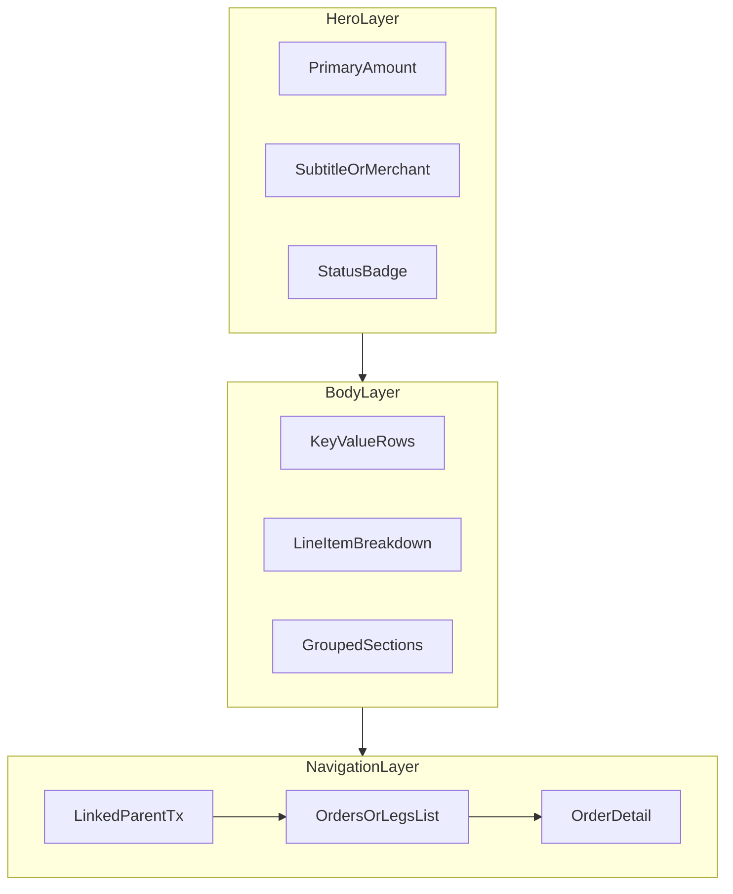

# Fintech transaction details — UX benchmark (Mobbin)

Референсы **только** neobank / investing / crypto / rewards-fintech (iOS). Источник: [Mobbin](https://mobbin.com) через MCP `search_screens`, deep mode. Дата сбора: **2 Jun 2026**.

**Не входит:** retail receipts (7-Eleven, Shell), e-commerce (Etsy), delivery (Snoonu). Их не используем как эталон для Exness Rewards.

**Сверка с продуктом:** [`TRANSACTION_DETAIL_FINTECH_GAP_ANALYSIS.md`](TRANSACTION_DETAIL_FINTECH_GAP_ANALYSIS.md) · [`TRANSACTIONS_CATALOG.md`](../product/TRANSACTIONS_CATALOG.md)

---

## 1. Метод

| Параметр | Значение |
|----------|----------|
| Платформа | iOS |
| Режим поиска | `deep` |
| Whitelist | Revolut, Wise, Coinbase, Acorns, Monzo, Chase UK, Wealthsimple (+ Public как trading-аналог) |
| Отбор экрана | Post-tap **detail / receipt / tracker**; не onboarding, не buy-flow без breakdown |
| Доказательство | Каждый паттерн — ссылка `mobbin.com/screens/{uuid}` |

---

## 2. Taxonomy слоёв UI

---

## 3. Cross-app patterns (сводка)

| Pattern ID | Описание | Кто делает | Пример Mobbin |
|------------|----------|------------|---------------|
| **H1** | Крупная сумма + знак (+/−) в hero | Revolut, Monzo, Chase, Coinbase | [Revolut +$20](https://mobbin.com/screens/2d2e3b4d-ac79-444a-a0a8-25730f8e3e0c) |
| **H2** | Subtitle = действие («Buy AAPL», «Money added via Apple Pay») | Revolut, Wealthsimple | [Revolut Market Buy](https://mobbin.com/screens/18476ac4-87ab-454b-b1e1-9a11904fa5b2) |
| **H3** | Chip/badge статуса под суммой | Exness (прототип), Acorns, Chase | [Chase Cashback earned](https://mobbin.com/screens/fee75193-7473-4b72-b3a7-e0d4f517b7ac) |
| **S1** | Секции CAPS: ACTIVITY / DETAILS / SPENDING | Chase UK | [Chase reward drill](https://mobbin.com/screens/fee75193-7473-4b72-b3a7-e0d4f517b7ac) |
| **S2** | Карточки с rounded rect (Revolut dark cards) | Revolut | [Revolut fees card](https://mobbin.com/screens/3f5743c6-7f49-49ba-95fd-ef688330288c) |
| **S3** | Плоский label \| value без секций | Coinbase, Acorns, Wealthsimple | [Coinbase Bought Bitcoin](https://mobbin.com/screens/c17e1736-36d9-47f6-b99b-5ca3b40bb76f) |
| **B1** | Breakdown: Amount → Fees → Net / Traded value | Revolut, Coinbase | [Revolut XAU buy](https://mobbin.com/screens/fa21c6a4-d921-4590-b0d4-2b6fd2c29e30) |
| **B2** | Fees с (i) и синим акцентом | Revolut | [Revolut AAPL sell](https://mobbin.com/screens/3f5743c6-7f49-49ba-95fd-ef688330288c) |
| **P1** | Pending: progress bar + estimated date | Acorns, Wise timeline | [Acorns Transferring](https://mobbin.com/screens/c8abf0b9-e682-4dd2-90e6-43bce99077c1) |
| **P2** | Pending: пошаговый tracker (Sent → Received) | Wise | [Wise tracker](https://mobbin.com/screens/d889a123-a33f-4f6a-b1f8-b302d3d548a9) |
| **P3** | Pending: объясняющий copy («2 days to claim») | Monzo | [Monzo payment link](https://mobbin.com/screens/e86b5daa-dc8c-4f08-bdef-fa5733f42a98) |
| **R1** | Reward привязан к parent purchase (ACTIVITY row) | Chase UK | [Chase Purchase + cashback row](https://mobbin.com/screens/e6e42ddd-01a2-426b-87de-bb58afb0227b) |
| **R2** | Dual outcome: fiat spend + «You'll earn $X to account» | Wealthsimple | [Wealthsimple authorized](https://mobbin.com/screens/2808c9d5-2457-40e1-8a07-142090cded79) |
| **N1** | Child list → drill-down (orders, legs) | Revolut history, Exness pack | [Revolut Trade history](https://mobbin.com/screens/6c1ea3b9-4e4b-47ef-b08d-a87ac9377b47) |
| **A1** | Secondary actions: Download, Get help, Add note | Revolut, Monzo | [Revolut +$20 cards](https://mobbin.com/screens/2d2e3b4d-ac79-444a-a0a8-25730f8e3e0c) |
| **C1** | Зелёный = inflow; красный/нейтральный = outflow | Monzo, Coinbase list | [Monzo paid you](https://mobbin.com/screens/0022dc77-b166-4cd3-ad05-7e85b26ad767) |

---

## 4. Pattern library

### 4.1 Hero и иерархия

| Элемент | Типичное поведение | Примеры EN copy |
|---------|-------------------|-----------------|
| Primary amount | Самый крупный шрифт; знак обязателен для направления | `+$20`, `-US$1.99`, `+ £0.03` |
| Secondary line | Тип операции или merchant | `Market Buy 0.004 AAPL`, `Money added via Apple Pay` |
| Merchant / icon | Логотип справа или слева от title | Apple logo, Co-op, Asda |
| Reward-specific hero | Отдельный экран «Cashback earned» с меньшей суммой reward | `Cashback earned` + `+ £0.03` |

**Выделение:** positive amounts — **green** (Monzo incoming, Chase cashback, Coinbase Completed dot); fees и info — **blue** + optional `(i)` (Revolut).

### 4.2 Статусы (vocabulary)

| UI term | Когда | Apps |
|---------|-------|------|
| **Completed** | Финальный success (top-up, crypto buy) | Revolut, Coinbase |
| **Authorized** | Hold / pre-settlement | Wealthsimple |
| **Pending** | Ещё не зачислено | Chase DETAILS, Acorns |
| **Transferring** | In-flight bank transfer | Acorns |
| **Being processed / Sent / Received** | Этапы transfer | Wise |
| **Payment link pending** | Ожидание действия получателя | Monzo |
| **Executed / order created** | Trading (не всегда = settled) | Revolut toast/sheet |
| **Tracked** | Cashback ещё не approved | Rakuten (см. gap doc) |

**Прототип Exness:** Upcoming / Activated / Credited / Transferred / Adjusted — ближе к **product-specific** chip, чем к generic «Completed».

### 4.3 Поля metadata (labels)

Частые **label → value** пары (порядок варьируется):

| Label (EN) | Роль | Apps |
|------------|------|------|
| Status | Settlement state | Revolut, Coinbase, Chase DETAILS |
| Date / Completed on | Timestamp (often with timezone implicit) | Coinbase `12:17 PM – Jun 2, 2022` |
| From / To | Accounts, wallets | Revolut recurring, Acorns confirm |
| Payment method / Card | Instrument | Revolut `MASTERCARD ··2675` |
| Amount / Traded value / Fees | Trade breakdown | Revolut, Coinbase |
| Price per coin / 1 AAPL = | Rate at execution | Revolut, Coinbase |
| Network fee | Crypto-specific | Coinbase |
| Subtotal / Total | Receipt math | Coinbase |
| Settlement date | When shares/money settle | Revolut |
| Reference code | Idempotency / support | Coinbase `Q9QYH7LE` |
| Category | Spending bucket | Revolut, Monzo |
| Rewards to / You'll earn… | Destination of reward | Wealthsimple |
| Estimated arrival / Credits on | Future credit date | Acorns, Exness «Available on» |

**Порядок в Exness catalog:** **When → From → To → Why → Other**. Chase reward screen: hero → **ACTIVITY** (parent tx) → **DETAILS** (From, Status).

### 4.4 Breakdown и вложенность

| Модель | Структура | Релевантность для Exness |
|--------|-----------|---------------------------|
| **Trade card** | Amount, Fees, Traded value, Price, Estimated shares | Cashback pack: EXD debited + USD leg + Rate |
| **Transfer tracker** | Vertical timeline + status text | Upcoming loyalty/cashback до среды |
| **Orders list** | Preview + View all → row detail | `RewardDetailModal` pack → `OrdersListView` |
| **Linked activity** | Одна строка parent purchase на reward screen | Опционально для cashback «за сделку» |

### 4.5 Действия внизу экрана

| Action | Apps |
|--------|------|
| Download (confirmation) | Revolut |
| Get help | Monzo pending, 7-Eleven (не benchmark) |
| Add note / category | Monzo, Revolut |
| Cancel (pending only) | Monzo, Acorns |
| Share activity | Wealthsimple order complete |
| Done / Close | Coinbase |

Exness modal: back stack pack → orders → order; без Download/Help в текущем прототипе.

---

## 5. Per-app appendix

### Revolut

| Тип | Что на экране | Mobbin |
|-----|---------------|--------|
| Top-up detail | `+$20`, subtitle, cards: Status Completed, Payment method, Category, Get help | [2d2e3b4d](https://mobbin.com/screens/2d2e3b4d-ac79-444a-a0a8-25730f8e3e0c) |
| Stock buy/sell | Hero −amount; card: Amount, Fees (i), Traded value, Price (trend), Estimated shares/units; Settlement date | [18476ac4](https://mobbin.com/screens/18476ac4-87ab-454b-b1e1-9a11904fa5b2), [3f5743c6](https://mobbin.com/screens/3f5743c6-7f49-49ba-95fd-ef688330288c) |
| Commodity (XAU) | Same breakdown + risk disclaimer | [fa21c6a4](https://mobbin.com/screens/fa21c6a4-d921-4590-b0d4-2b6fd2c29e30) |
| History list | Tabs All / Buys / Sells; row: type, date, amount | [6c1ea3b9](https://mobbin.com/screens/6c1ea3b9-4e4b-47ef-b08d-a87ac9377b47) |

**UX вывод:** trading detail = **прозрачный fee split**; payment detail = **группировка по карточкам** + metadata actions.

### Wise

| Тип | Что на экране | Mobbin |
|-----|---------------|--------|
| Transfer tracker | Hero amount; timeline: Being processed → Sent → Received; expandable «Details» | [d889a123](https://mobbin.com/screens/d889a123-a33f-4f6a-b1f8-b302d3d548a9) |
| Received detail | «You received GBP X»; list: Created, Received by, Reference, Sent from, Transferwise ID | [aa868a5e](https://mobbin.com/screens/aa868a5e-3505-4b44-aa86-b9fb9f60a2e7) |

**UX вывод:** **время как narrative** (этапы), не один chip; reference IDs для support.

### Coinbase

| Тип | Что на экране | Mobbin |
|-----|---------------|--------|
| Buy receipt | Title «Bought Bitcoin»; crypto amount + fiat hero; Reference, Price per coin, Network fee, Subtotal, Total, Date, **Completed** (green dot) | [c17e1736](https://mobbin.com/screens/c17e1736-36d9-47f6-b99b-5ca3b40bb76f) |
| List (не detail) | Dual line: fiat + asset amount; green + for inflow | [79e71b57](https://mobbin.com/screens/79e71b57-c80e-48e8-8029-5dee40eaa5b6) |

**UX вывод:** **fee line explicit** (Network fee); status внизу списка полей, не только chip.

### Acorns

| Тип | Что на экране | Mobbin |
|-----|---------------|--------|
| Transaction detail | Title + date; amount grey-large; **Transaction status** + progress bar «Transferring» + **Estimated Feb 13** | [c8abf0b9](https://mobbin.com/screens/c8abf0b9-e682-4dd2-90e6-43bce99077c1) |
| Pending list | Step dots + Cancel in expanded row | [868dd613](https://mobbin.com/screens/868dd613-d8f2-4de5-b0a2-13056a63048a) |

**UX вывод:** pending = **progress + ETA**, не только «Upcoming» chip.

### Monzo

| Тип | Что на экране | Mobbin |
|-----|---------------|--------|
| Purchase detail | Merchant, amount, category, notes #tags, Add receipt | [51467ec9](https://mobbin.com/screens/51467ec9-9136-4bb2-9b37-6a74a56e56ce) |
| Incoming | Green amount; «paid you»; category; contextual «Send money back» | [0022dc77](https://mobbin.com/screens/0022dc77-b166-4cd3-ad05-7e85b26ad767) |
| Pending payment link | Status title + explanatory paragraph + Cancel / Get help | [e86b5daa](https://mobbin.com/screens/e86b5daa-dc8c-4f08-bdef-fa5733f42a98) |

**UX вывод:** rich metadata + **plain-language explanation** for non-obvious pending states.

### Chase UK

| Тип | Что на экране | Mobbin |
|-----|---------------|--------|
| Cashback reward | Nav «Rewards»; hero «Cashback earned» + amount; **ACTIVITY** Co-op £2.90; **DETAILS** From, Status **Pending** | [fee75193](https://mobbin.com/screens/fee75193-7473-4b72-b3a7-e0d4f517b7ac) |
| Purchase | Map, merchant, amount; row «Cashback earned» chevron | [e6e42ddd](https://mobbin.com/screens/e6e42ddd-01a2-426b-87de-bb58afb0227b) |

**UX вывод:** **ближайший аналог** loyalty/cashback pack: reward amount hero + link to earning activity + pending in details.

### Wealthsimple

| Тип | Что на экране | Mobbin |
|-----|---------------|--------|
| Card spend | Merchant; «You authorized $X»; line «You'll earn $Y towards Trade: TFSA»; card: Status, Date, **Rewards to** | [2808c9d5](https://mobbin.com/screens/2808c9d5-2457-40e1-8a07-142090cded79) |
| Order complete | «Order complete»; quantity; **View details →** | [3e7e2647](https://mobbin.com/screens/3e7e2647-c413-4783-938e-a620d054447e) |

**UX вывод:** **prospective reward** under amount (до зачисления); минимальный KV-card.

### Public (trading, proxy Robinhood-style)

| Тип | Что на экране | Mobbin |
|-----|---------------|--------|
| Trade confirm | Symbol, side, qty, price, fees, total, Submit | [8aa2cba0](https://mobbin.com/screens/8aa2cba0-3e15-47f4-aac7-9065633e39e6) |

---

## 6. Anti-patterns (не переносим)

| Noise | Почему skip |
|-------|-------------|
| Retail receipt (7-Eleven, Shell) | Другой домен (SKU, tax, store address) |
| ShopBack list-only cashback | Нет единого «reward detail» как у Chase |
| Coinbase order book / buy keypad | Pre-trade, не post-trade detail |
| Wealthsimple «Claim reward» marketing | Onboarding, не ledger detail |
| Dark mode / maps как обязательные | Опционально позже; не в scope CE-3142 |

---

## 7. Implications для Exness (кратко)

Полная сверка — в [`TRANSACTION_DETAIL_FINTECH_GAP_ANALYSIS.md`](TRANSACTION_DETAIL_FINTECH_GAP_ANALYSIS.md).

| Наша сила | Референс |
|-----------|----------|
| Chip Upcoming / Credited / Adjusted | Chase Pending в DETAILS; Acorns Transferring |
| To → Available rewards; Credits on / Available on | Wise To/From; Wealthsimple Rewards to |
| Pack + orders drill-down | Revolut history; Coinbase fee breakdown per leg |
| UTC в When | Coinbase full timestamp |

| Зона роста | Референс |
|-----------|----------|
| Секции ACTIVITY / DETAILS для cashback | Chase fee75193 |
| ETA / progress для Upcoming | Acorns c8abf0b9, Wise d889a123 |
| Sync list ↔ modal (credited cashback) | Coinbase consistency |
| Fee/leg breakdown в order detail | Revolut 3f5743c6, Coinbase c17e1736 |
