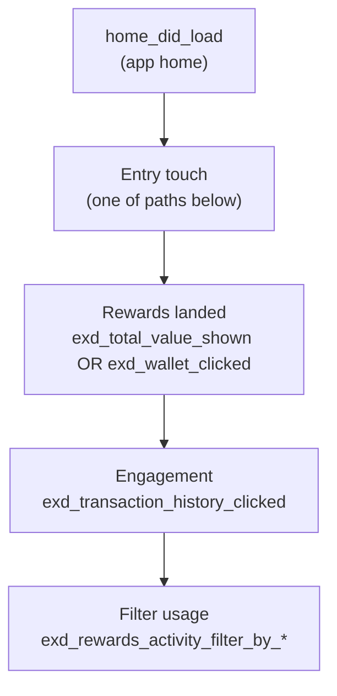

# Entry paths — Home → Exness Rewards

How users **enter** the EXD / Rewards section from elsewhere in Mobile Trader app, and where they **drop off** before engaging.

Project: **207818** · Related: [`EXD_EVENTS_CATALOG.md`](../TAXONOMY/EXD_EVENTS_CATALOG.md)

---

## Funnel anchor (session-level)

**Drop-off metrics** (to build in Amplitude):

| Step | Conversion question |
|------|---------------------|
| A → B | % sessions with any EXD entry touch after home |
| B → C | % entry touches that reach Rewards home |
| C → D | % Rewards visitors who open Activity |
| D → E | % Activity users who use filters |

**Segment:** breakdown by `value_segment` on every step — [`CLIENT_GROUPS.md`](../SEGMENTS/CLIENT_GROUPS.md).

---

## Entry path catalog

### 1. Bottom navigation / tabs

| Event | Hypothesis |
|-------|------------|
| `tab_selected` | User taps bottom nav — **need property** for rewards/exd tab name |
| `Tab Changed` | Legacy equivalent |

**Gap:** no dedicated `rewards_tab_opened`. First analysis task: inspect `tab_selected` event properties via `search` (EVENT_PROPERTY) or sample user timeline.

### 2. Accounts area

| Event | Path |
|-------|------|
| `exd_on_accounts_clicked` | EXD entry from Accounts screen |
| `accounts_tab_click` → `accounts_tab_shown` | Accounts tab visit before EXD click |

### 3. Home / balance widgets

| Event | Path |
|-------|------|
| `exd_balance_clicked` | Balance / wallet widget on home or rewards |
| `Wallet accounts menu item in balance drop down widget clicked` | Balance dropdown → wallet accounts |

### 4. Banners & pre-opt-in

| Event | Path |
|-------|------|
| `exd_rewards_pre_opt_in_banner_clicked` | Banner on home or PA |
| `exd_rewards_popup_shown` → `exd_rewards_popup_button_clicked` | Modal promo |
| `exd_dynamic_popup_*` | Dynamic promo entry |

### 5. Onboarding / first-time flows

| Event | Path |
|-------|------|
| `exd_onboarding_rewards_shown` | First rewards onboarding |
| `exd_intro_screen_shown` → `exd_intro_screen_continue_clicked` | Intro carousel |
| `exd_rewards_activation_popup_*` | Activation modal |
| `exd_pilot_*_popup_*` | Legacy pilot entry |

### 6. Crypto lander (adjacent product)

| Event | Path |
|-------|------|
| `exd_crypto_lander_*` | Crypto-specific EXD lander → may funnel into Rewards |

### 7. Notifications / deeplinks

**TBD** — search for deeplink / push open events with EXD destination. Not in initial `exd_*` inventory.

---

## Cross-entry analysis plan (next task)

1. **Pathing chart:** events before first `exd_total_value_shown` in session (by value_segment)
2. **Sankey / Journey:** top 5 entry sequences → Rewards home
3. **Compare segments:** which value_segment uses Accounts vs tab vs banner most?
4. **Replay audit:** sessions that hit `home_did_load` + entry touch but **not** `exd_total_value_shown`

---

## CE-3142 prototype mapping

| Prototype entry (conceptual) | Best Amplitude proxy today |
|-----------------------------|----------------------------|
| Tap Rewards in bottom nav | `tab_selected` (property TBD) |
| Tap wallet on Rewards home | `exd_wallet_clicked` |
| Tap Activity preview row | **Gap** — use `exd_transaction_history_clicked` for full feed only |
| Lifetime cashback → Activity with Cashback filter | **Gap** — no dedicated event |

Instrument gaps tracked in [`DATA_QUALITY.md`](../TAXONOMY/DATA_QUALITY.md).
