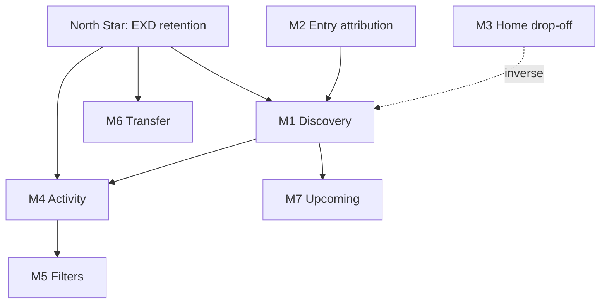

# KPI tree — CE-3142 Amplitude research

Objectives → input metrics → Amplitude events → prototype screens.

---

## North star

**EXD program retention** — users stay in Rewards program and continue trading with active EXD benefits.

Proxy metrics (until retention cohort built): monthly return to Rewards home + Activity engagement.

---

## Input metrics

| Metric | Definition | Key events | Prototype |
|--------|------------|------------|-----------|
| **M1 Discovery** | User reaches Rewards home | `exd_total_value_shown`, `exd_wallet_clicked` | ExnessRewardsScreen |
| **M2 Entry attribution** | Known path into Rewards | Entry events in [`ENTRY_PATHS.md`](../JOURNEYS/ENTRY_PATHS.md) | — |
| **M3 Home drop-off** | Home load without Rewards reach | `home_did_load` → no `exd_*` | App shell |
| **M4 Activity engagement** | Opens Activity feed | `exd_transaction_history_clicked` | ActivityFeedScreen |
| **M5 Filter adoption** | Uses Type/Date filters | `exd_rewards_activity_filter_by_*` | Filter chips |
| **M6 Transfer completion** | Completes EXD transfer | `exd_transfer_confirm` | Step 6 modal |
| **M7 Upcoming awareness** | Sees upcoming cashback | `exd_upcoming_cashback_shown` | Upcoming cell |

---

## Segmentation (required)

All M1–M7: **breakdown by `value_segment`** (5 client groups).

Optional overlays: `tier`, `reward_schemas`, platform (iOS/Android).

---

## Metric tree

---

## CE-3142 design decisions (analytics implications)

From product rules:

- **Upcoming cashback on Rewards home:** USD aggregate — segment comparison should use same definition in backend
- **Activity Cashback filter hero:** USD aggregate — filter usage (M5) may correlate with multi-currency users
- **Drill-in:** per-account native currency — modal events missing today; add to KPI tree when instrumented

---

## Success criteria for research phase

| Phase | Deliverable |
|-------|-------------|
| Prep | Taxonomy + segments docs (this folder) |
| Baseline | Charts for M1, M3, M4 by value_segment |
| Insights | 1–2 analysis memos in `analyses/` |
| Gaps | Instrumentation recommendations for modal drill
